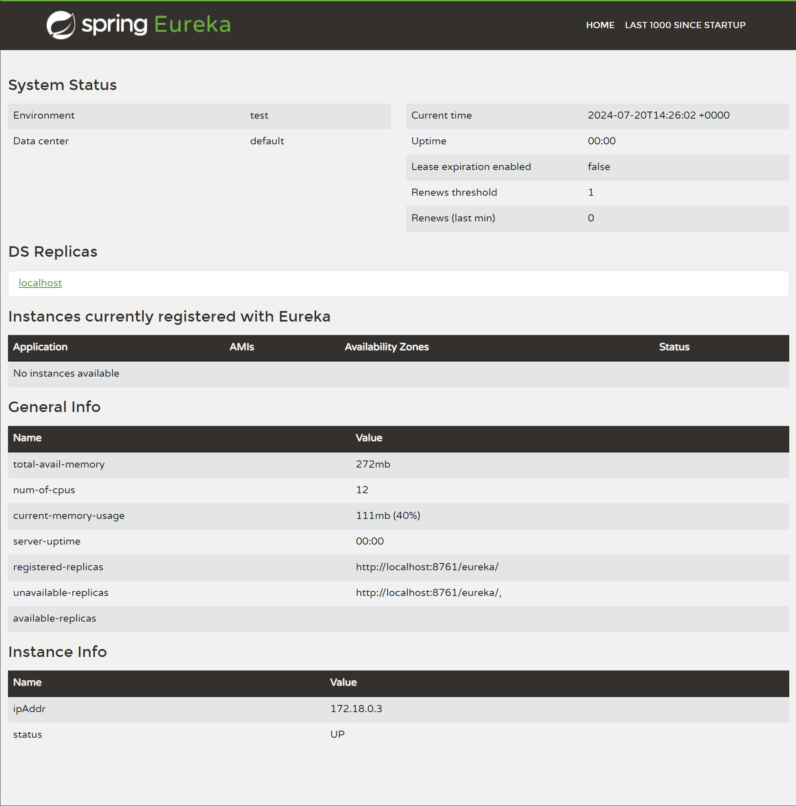

# Spring Eureka Server

> Spring Cloud Discovery Server

MSA환경에서 서비스들을 등록하고 찾을 수 있는 서버입니다.

## How to create a Eureka Server

### Eureka 의존성 추가

`build.gradle` 파일에 Eureka 서버 의존성을 추가합니다.

```gradle
dependencies {
    implementation 'org.springframework.cloud:spring-cloud-starter-netflix-eureka-server'
}
```

### Eureka 서버 설정

메인 클래스에 `@EnableEurekaServer` 어노테이션을 추가합니다.

```kotlin
@SpringBootApplication
@EnableEurekaServer
class EurekaApplication
fun main(args: Array<String>) {
	runApplication<EurekaApplication>(*args)
}
```

`application.yml` 파일에 Eureka 서버 설정을 추가합니다.

```yaml
server:
  port: 8761

eureka:
    client:
        register-with-eureka: false
        fetch-registry: false
        service-url:
          defaultZone: http://localhost:8761/eureka
```

- 기본적으로 Eureka 8761 포트를 사용합니다.
- `register-with-eureka` : Eureka 서버에 자신을 등록할지 여부
- `fetch-registry` : Eureka 서버의 등록된 서비스 목록을 가져올지 여부
- `defaultZone` : Eureka 서버의 주소


### 서버 실행 

`EurekaApplication` 클래스를 실행하면 Eureka 서버가 실행됩니다.

```shell
./gradlew bootRun
```

브라우저에서 [http://localhost:8761](http://localhost:8761)로 접속하면 Eureka 서버 대시보드를 확인할 수 있습니다.



## Eureka Client 등록

Eureka 서버에 서비스를 등록하려면 Client 서비스에서 Eureka Client 의존성을 추가하고 설정을 추가해야 합니다.

`build.gradle` 파일에 Eureka Client 의존성을 추가합니다.

```gradle
dependencies {
    implementation 'org.springframework.cloud:spring-cloud-starter-netflix-eureka-client'
}
```

`application.yml` 파일에 Eureka Client 설정을 추가합니다.

```yaml
spring:
  application:
    name: service-name
eureka:
    client:
        service-url:
        defaultZone: http://localhost:8761/eureka
```

*Spring Cloud 2022.0 버전부터는 `@EnableDiscoveryClient` 어노테이션을 사용하지 않습니다.*
